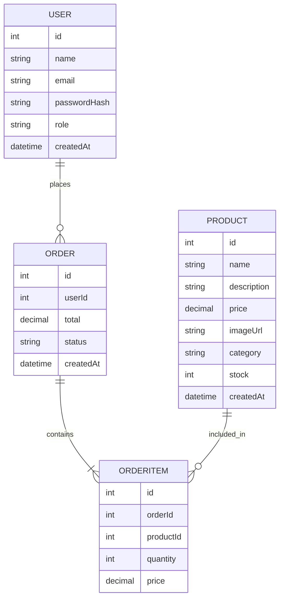

# Database Schema

_What are the main entities and relationships in your data model?_

---

## ER Diagram

<small>(Example diagram. Replace or expand as needed for your project.)</small>

---

## Description

_Describe the main entities, their relationships, how they interact, and why they fit into the big picture. describe in natural language_

The main entities are USER, PRODUCT, ORDER, and ORDERITEM. A USER can place many ORDERs, each ORDER can contain multiple ORDERITEMs, and each ORDERITEM references a PRODUCT. This structure allows customers to purchase multiple products in a single order, and for the system to track inventory, order status, and user history. The relationships support features like order history, inventory management, and personalized shopping experiences. Admins can manage products and view all orders, while customers interact mainly with products and their own orders.

<small>(Example description. Replace or expand as needed for your project.)</small>

---

<small>Add more entities and relationships as your project grows.</small>
